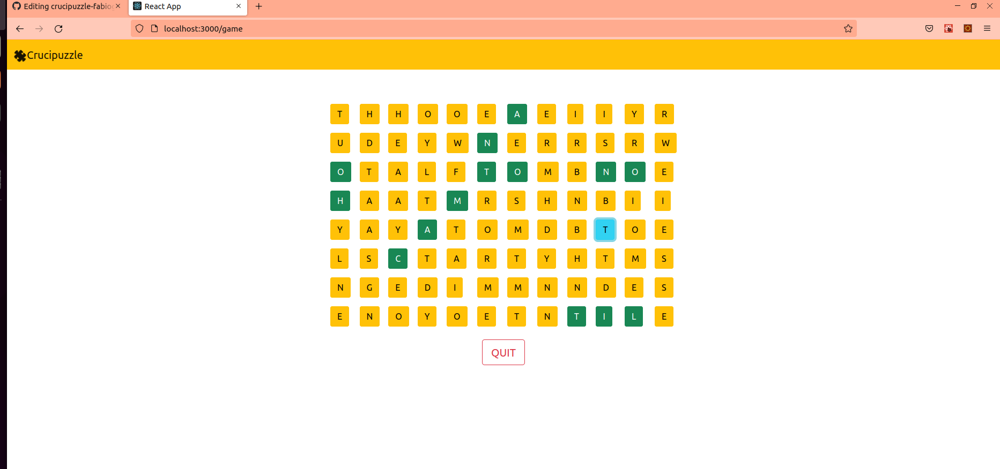

# Exam #5: "Crucipuzzle"
## Student: s287873 GRILLO FABIO 

## React Client Application Routes

- Route `/`: concettualmente main page dell'applicazione; consiste in un bottone per iniziare il gioco ed eventualmente, nel caso in cui l'utente sia loggato, in un ulteriore bottone per la visualizzazione dei risultati personali.
- Route `/game`: route pensata per il gioco vero e proprio, dapprima si sceglie la difficoltà e successivamente compare la tabella con tutte le lettere.
- Route `/login`: route dedicata al form del login
- Route `/halloffame`: qui si mostra la tabella con i cinque migliori punteggi tra tutti i giocatori registrati
- Route `/myScores`: volta alla visione dello storico dei punteggi del giocatore loggato

## API Server

- GET `/api/letters/:difficulty`
  - ritorna un vettore di lettere di dimensione pari al numero di caselle della tabella che dovrà essere renderizzata in base alla difficoltà, passata come parametro; il vettore è formato dapprima inserendo un numero di lettere proporzionale alla loro frequenza nell'alfabeto inglese; successivamente il vettore viene mischiato e troncato ad una dimensione data dalla difficoltà.
  - la risposta ritorna con stato `200 OK` nel caso di successo con body:
  ```json
  ["A","E","K","E",...]
  ```
  oppure `404 Not Found` nel caso di fallimento con body:
  ```json
    {
      "error": "Error with retrieving letters."
     }
  ```

- GET `/api/words/:word`
  - ritorna ```word``` nel caso in cui sia effettivamente una parola del dizionario inglese
  - la risposta ritorna con stato `200 OK` nel caso di successo con body:
  ```json
    [
      {
        "word":"HELLO"
      }
    ]
  ```
  oppure con stato `404 Not Found` nel caso di fallimento con body:
  ```json
    {
      "error":"'Word Not Found!" 
    }
  ```
  
- GET `/api/scores`
  - ritorna l'elenco dei 5 migliori risultati globali ordinati per punteggio in ordine decrescente e nome crescente
  - la risposta ritorna con stato `200 OK` nel caso di successo con body:
  ```json
  [
    {
      "name":"user3","score":25000
    },
    {
      "name":"user1","score":15000
    },
    ...
  ]
  ```
  oppure con stato `404 Not Found` nel caso di fallimento con body:
  ```json
    {
      "error":"'Impossible to retrieve best 5 scores!" 
    }
  ```
 
- GET `/api/scores/:id`
  - ritorna l'elenco completo di tutte le partite giocate dal giocatore loggato 
  - la risposta ritorna con stato `200 OK` nel caso di successo con body:
  ```json
    [
      {
        "score":1500
      },
      {
        "score":6000
      },
      ...
    ]
  ```
  oppure con stato `404 Not Found` nel caso di fallimento con body:
    ```json
      {
       "error" : "Impossible to retrieve personal scores!" 
     }
    ```

- POST `/api/scores`
  - crea un nuovo punteggio per l'utente loggato da inserire nel db.
  -  la richiesta è con body:
  ```json
    [
      {
        "id" : "2",
        "score" : "5000"
      }
    ]
  ```
  la risposta restituisce `201 Created` in caso di successo oppure `503 Service Unavailable` in caso di errore con errore:
  ```json
    [
      {
        "error" : "Server error during the creation of score ${req.body.score}"
      }
    ]
  ```

- POST - `/api/sessions`

  login

  ```js
  fetch('/api/sessions', {
    method: 'POST',
    headers: {
      Accept: 'application/json',
      'Content-Type': 'application/json',
    },
    body: {
  	username: 'user1@polito.it'
  	password: 'password'
    },
  });
  ```

  La risposta è `200 OK` in caso di successo con body

  ```json
  {
  "id":1,
  "username":"user1@polito.it",
  "name":"user1"
  }
  ```

  oppure è `401 Unauthourized` in caso di fallimento con body

  ```
  {
  "message":"Incorrect username and/or password."
  }
  ```

- GET - `/api/sessions/current`

  controlla se l'utente è loggato o no

  ```js
  fetch('/api/sessions/current', {
    method: 'GET',
    headers: {
      Accept: 'application/json',
      'Content-Type': 'application/json',
    },
  });
  ```

  la riposta è `200 OK` in caso di successo con body 

  ```json
  {
  "id":1,
  "username":"user1@polito.it",
  "name":"user1"
  }
  ```

 oppure in caso di fallimento è `401 Unauthourized` con body

  ```json
  {
  "error": 'Unauthenticated user!'
  }
  ```

- DELETE - `/api/sessions/current`
    
 
## Database Tables

- Tabella `letters` - contiente i campi "letter" con l'elenco di tutte le lettere dell'alfabeto e "frequency" con le rispettive frequenze nella lingua inglese
- Tabella `words` - contiente l'elenco di tutte le parole della lingua inglese in maiuscolo estratto da http://www.mieliestronk.com/wordlist.com
- Tabella `users` - contiene le colonne id, email, name e hash riferite ai dati degli utenti registrati
- Tabella `scores` - contiene le colonne id e score, dove id è l'identificativo dell'utente che ha giocato la partita e score rappresenta il punteggio realizzato.

## Main React Components

I componenti sono raggruppati all'interno della cartella Components per maggior chiarezza.

- `DifficultyButtons` (in `Game.js`): renderizza 5 tasti in colonna che permettono di selezionare la difficoltà
- `GameTable` (in `Game.js`): tabella tanto più grande quanto più alto è il livello di difficoltà selezionato, sotto è presente il tasto "QUIT!" che permettere di interrompere il gioco in maniera controllata. Sse non si clicca il tasto, la tabella rimane a schermo fino allo scadere dei 60 secondi di gioco e successivamente viene renderizzato un componente Alert che indica all'utente (loggato e non) il punteggio realizzato e permettere tramite tasto "Restart" di iniziare una nuova partita o tramite tasto "Home Page" di ritornare alla pagina iniziale.
- `LoginForm` (in `Login.js`): mostra un form in cui è possibile effettuare l'accesso. Precaricato con email e password dell'utente 1 già corretti.
- `Navbar` (in `Navbar.js`): da sinistra a destra sono presenti logo, sezione Halloffame e tasto login. Una volta effettuato il login viene mostrato il nome dell'utente loggato e il tasto di logout; questi risultano assenti durante il gioco per evitare comportamenti anomali ed indesiderati dell'applicazione.
- `RankTable` (in `Ranking.js`) renderizza una tabella con la classifica dei 5 migliori punteggi estratti dal db.
- `InitialPage` (in `StartPage.js`) si compone di uno o, nel caso di utente loggato, due bottoni; il primo in alto consente di iniziare la partita, il secondo permette all'utente di accedere allo storico delle proprie partite.
- `PersonalTable` (in `PersonalPage.js`) renderizza una tabella dove compaiono in ordine cronologico il # numero della partita giocata ed il rispettivo punteggio.

## Screenshot
<p align="center">
  
</p>

## Users Credentials

- user1@polito.it, password 
- user2@polito.it, password 
- user3@polito.it, password (con punteggio più alto precaricato nel db -> 25000)
